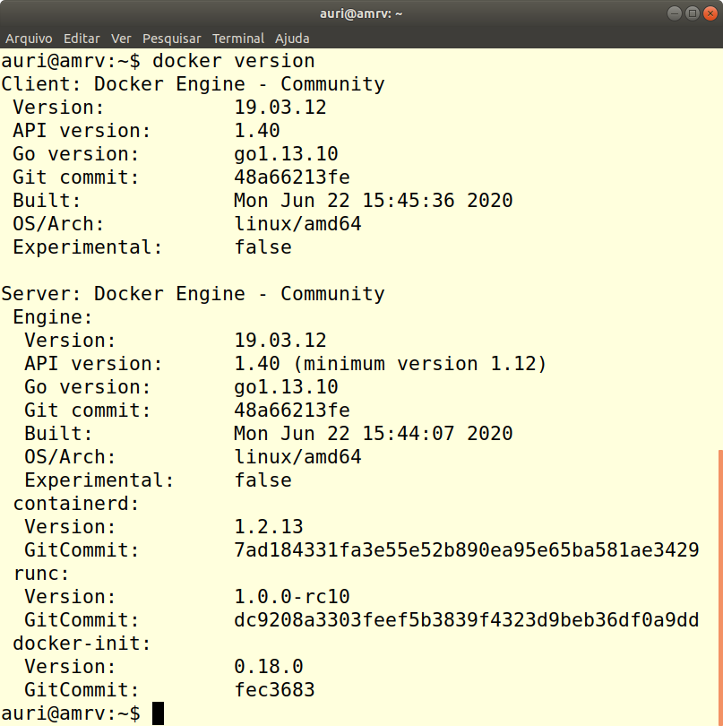
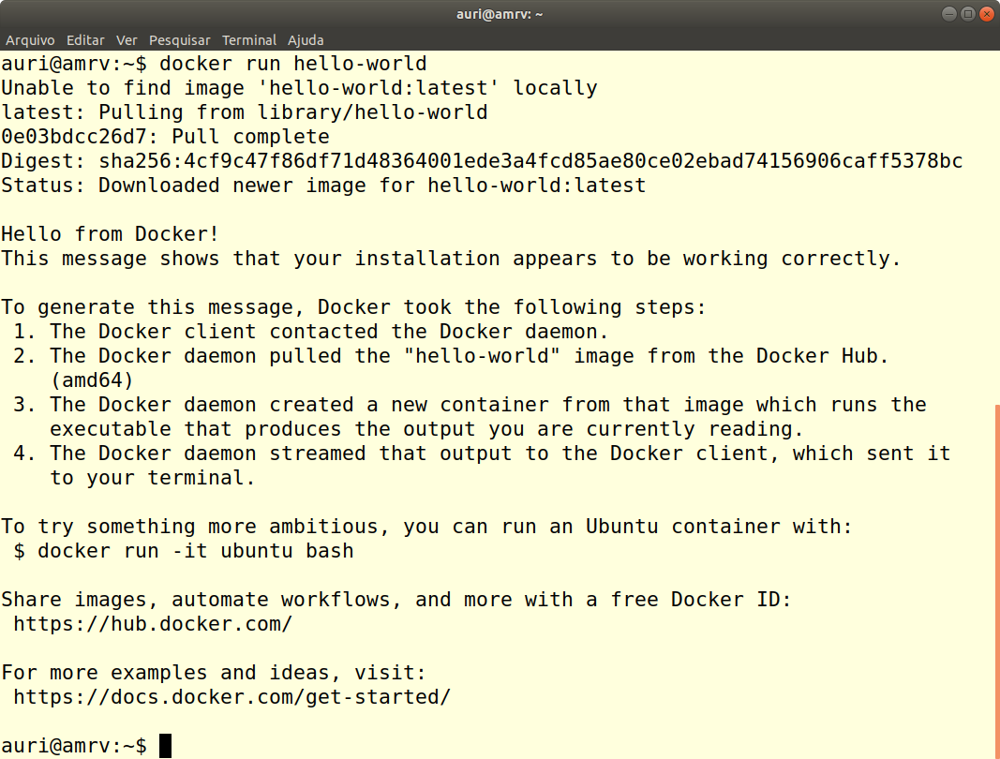

# 1.3 Configuração do Ambiente

Um dos grandes desafios no uso de tecnologias voltadas para o desenvolvimento de aplicações diz respeito à configuração de ambientes para o desenvolvimento e execução do produto de software produzido. A cada novo colaborador que chega na organização, a preparação do ambiente de trabalho pode consumir um tempo significativo. Conforme visto na seção anterior, o uso de máquinas virtuais simplificou bastante esse processo mas, as máquinas virtuais ainda sofrem do problema da exigência de um SO completo em cada uma delas para prover os serviços necessários. A evolução das mesmas deu origem ao conceito de contêineres os quais possuem capacidades semelhantes as das máquinas virtuais com a vantagem de serem mais "leves" e demandarem menos recursos de hardware para sua execução.

A tecnologia de contêineres surgiu para facilitar essa atividade e simplificar não apenas a configuração do ambiente de desenvolvimento, como também o ambiente de execução da aplicação. Utiliza-se muito hoje o termo _dockerização de aplicação_ para fazer referência a uma aplicação que não era executada em contêineres e passa a ser após a _dockerização_.

O primeiro passa para dar início a esse processo é instalar as ferramentas do Docker que iremos fazer uso. Neste capítulo veremos como instalar e configurar o ambiente do Docker + Docker Compose que será utilizado nos capítulos a seguir. Apesar de apresentarmos a instalação do Docker no ambiente Windows, é altamente recomendável que você faça uso da plataforma no ambiente Linux por este ser mais estável e alinhado com a filosofia do Docker.

## Windows

* Faça o download do instalador do Docker Desktop [aqui](https://hub.docker.com/editions/community/docker-ce-desktop-windows/);
* Abra o instalador e siga as instruções **\(Importante: deixe a opção "Enable Hyper-V Windows Features" ativa!\)**;
* Quando o processo de instalação terminar, reinicie o computador;
* Ao reiniciar, abra o Docker Desktop para poder iniciar o _daemon_ do docker;
* Tanto o Docker quanto o Docker Compose estarão instalados e ativos na sua máquina, e podem ser testados abrindo uma janela do Powershell e inserindo comandos como `docker run hello-world`.

  > Obs: No Windows, o Docker Desktop também vem com um pequeno tutorial para começar a utilizar a ferramenta, pode ser útil.


## Linux Ubuntu via Repositório

Uma boa fonte de informação para a instalação do Docker é o seu próprio web site. Os passos da instalação no Ubuntu apresentados abaixo foram extraídas de lá, na opção _Download and Install_.

Os passos a seguir, correspondem a execução dos comandos para a instalação utilizando-se os repositórios de pacotes da própria Docker Inc. 

#### Configuração do repositório

* Remova instalações anteriores com 

```text
sudo apt-get remove docker docker-engine docker.io containerd runc
```

* Configure os repositórios

```text
sudo apt-get update

sudo apt-get install \
    apt-transport-https \
    ca-certificates \
    curl \
    gnupg-agent \
    software-properties-common
```

* Adicione a GPG Key oficial da Docker

```text
curl -fsSL https://download.docker.com/linux/ubuntu/gpg | sudo apt-key add -
```

* Verificação da identididade Docker. A _fingerprint_ exibida deve ser`9DC8 5822 9FC7 DD38 854A  E2D8 8D81 803C 0EBF CD88`

```text
sudo apt-key fingerprint 0EBFCD88
```

* A saída produzida pelo comando acima deve ser:

```text
pub   rsa4096 2017-02-22 [SCEA]
      9DC8 5822 9FC7 DD38 854A  E2D8 8D81 803C 0EBF CD88
uid           [ unknown] Docker Release (CE deb) <docker@docker.com>
sub   rsa4096 2017-02-22 [S]
```

* Configuração do repositório _stable_ como fonte para a instalação dos pacotes

```text
sudo add-apt-repository \
   "deb [arch=amd64] https://download.docker.com/linux/ubuntu \
   $(lsb_release -cs) \
   stable"
```

#### Instalação dos pacotes

* Utilize os comandos abaixo para a instalação do `docker` e `docker-compose` 

```text
sudo apt-get update

sudo apt-get install docker-ce docker-ce-cli containerd.io docker-compose
```

* Testando a instalação

```text
docker version

Client: Docker Engine - Community
 Version:           19.03.12
 API version:       1.40
 Go version:        go1.13.10
 Git commit:        48a66213fe
 Built:             Mon Jun 22 15:45:36 2020
 OS/Arch:           linux/amd64
 Experimental:      false
Cannot connect to the Docker daemon at tcp://127.0.0.1:2375. 
Is the docker daemon running?
```

Observa-se no comando acima que o docker está instalado na versão 19.03.12, entretanto, as configurações ainda não estão completas. Continue nos passos abaixo para finalizar as configurações para que a mensagem "_Cannot connect to the Docker daemon at tcp://127.0.0.1:2375. Is the docker daemon running?_" não seja mais exibida.

```text

```

#### Configurações pós-instalação

* Habilitar o uso do Docker para usuários sem privilégio de root. Após a execução do comando abaixo, o ideal é fazer o logoff e logar novamente na conta para habilitar as alterações nos grupos do Linux

```text
sudo usermod -aG docker $USER
```

* Após realizar o logout ou reinicializar a máquina, para verificar se você foi adicionado ao grupo, utilize o comando abaixo

```text
id
```

* O resultado, deve ser parecido com o apresentado abaixo. Observe que o usuário faz parte do grupo docker

```text
uid=1000(auri) gid=1000(auri) grupos=1000(auri),4(adm),24(cdrom),27(sudo),
30(dip),46(plugdev),116(lpadmin),126(sambashare),127(vboxusers),129(docker)
```

* Configure o Docker para inicializar no boot da máquina

```text
sudo systemctl enable docker
```

* Caso deseje desabilitar esse comportamento, basta executar

```text
sudo systemctl disable docker
```

* Configurar acesso remoto por meio do arquivo de unidade do **`systemd`**
  * Se após a instalação você observar que apareceu uma mensagem do tipo "_Cannot connect to the Docker daemon at tcp://127.0.0.1:2375. Is the docker daemon running?_", será necessária a execução dos passos abaixo.
  * Use o comando abaixo para sobrescrever o arquivo `docker.service`

```text
sudo systemctl edit docker.service
```

* Altere o conteúdo do arquivo para

```text
[Service]
ExecStart=
ExecStart=/usr/bin/dockerd -H fd:// -H tcp://127.0.0.1:2375
```

* Em seguida, reinicialize o systemctl

```text
sudo systemctl daemon-reload
```

* Reinicialize o serviço do docker

```text
sudo systemctl restart docker.service
```

#### Teste da instalação e execução do hello-world

Chegando até aqui, recomendo a reinicialização da máquina e o teste do Docker com a execução dos comandos a seguir

* Verificando o status da execução do docker daemon

```text
sudo systemctl restart docker.service
```

* Como resultado, esse comando irá apresentar algo parecido com o mostrado na imagem a seguir

```text
sudo service docker status
```


* Verificação da versão do Docker em execução. Observe que após todas as configurações acima, não aparece mais a mensagem de erro mostrada acima _Cannot connect to the Docker daemon at tcp://127.0.0.1:2375. Is the docker daemon running?_" e a saída do comando é correta conforma ilustrada na imagem abaixo.

```text
docker version
```



* Finalmente, podemos executar o Hello World do Docker com o comando abaixo. A imagem a seguir ilustra a saída resultante do comando.

```text
docker run hello-world
```



Se voc chegou até aqui com sucesso, o seu ambiente está pronto para a continuidade do nosso curso. Do contrário, poste sua dúvida de instalação no nosso Fórum que teremos o maior prazer em ajudar.

### Linux Arch

* No terminal, instale os pacotes `docker` e `docker-compose` com `sudo pacman -S docker docker-compose`
* Rode o comando `sudo usermod -aG docker $USER` para adicionar o usuário atual ao grupo do docker e então poder rodar o comando sem ser root;
* Feche o terminal e abra de novo \(talvez seja necessário reiniciar o computador para finalizar a instalação e ativar o daemon do docker\);
* Rode o comando `docker run hello-world` para confirmar que a instalação aconteceu corretamente.


